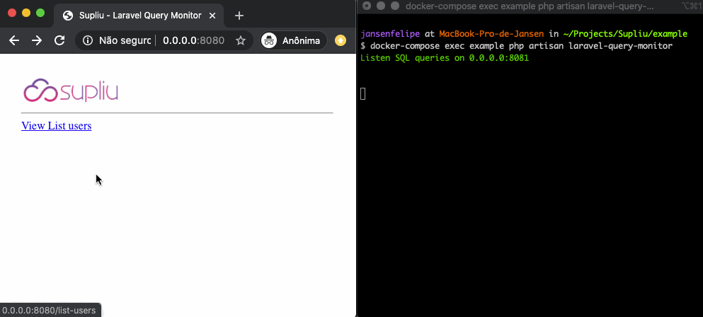

# Laravel Query Monitor
[](https://travis-ci.org/supliu/laravel-query-monitor)


<a href="https://supliu.com.br">Supliu</a> Laravel Query Monitor is library to monitoring Queries in real-time using Laravel Artisan Command. Basically it opens a socket listening and displays (on terminal) the queries executed in your Laravel application.

<p align="center">
  
</p>


## How to install

1) Use composer to install this package

```
composer require --dev supliu/laravel-query-monitor
```

2) Run publish command

```ssh
php artisan vendor:publish --provider="Supliu\LaravelQueryMonitor\ServiceProvider"
```

## How to use

Open you terminal and execute:

```ssh
php artisan laravel-query-monitor
```

Now just perform some action in your application that performs some interaction with the database.

## Customize

By default, the query listening service will run on host 0.0.0.0 and port 8081. You can customize both the host and the port by providing the optional arguments:

```ssh
php artisan laravel-query-monitor --host="192.168.0.2" --port=8082
```

If you change the host and port parameters, you will also need to change the configuration file `config/laravel-query-monitor.php`.

## License

The Laravel Query Monitor is open-sourced project licensed under the [MIT license](https://opensource.org/licenses/MIT).
